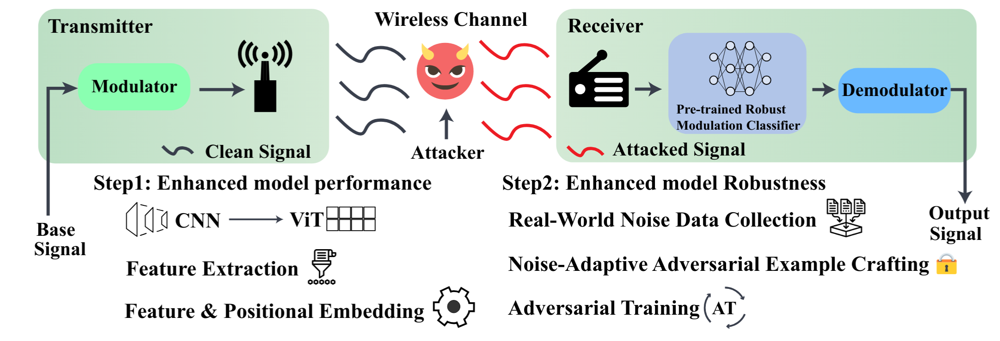

# Robust-ViT-for-AMC-S&P-2025
[S&amp;P2025] Adversarial Robust ViT-based Automatic Modulation Recognition in Practical Deep Learning-based Wireless Systems

## Introduction
We present a robust AMR system based on Vision Transformer to defend against adversarial attacks in non-cooperative wireless environments. The proposed
design leverages a feature extraction module and tailored feature and positional embeddings within the Transformer encoder to enhance model robustness. We further introduce a noise-adaptive AT to mitigate the practical impact of noise in generating effective adversarial perturbation. Through comprehensive real-world experiments based on a self-collected dataset, we validate the efficiency, accuracy, and effectiveness of the proposed framework.

The overview of our proposed ViT-based adversarial robustness AMR design. As the first step, using the novel ViT-based models is expected to significantly boost the AMR classification accuracy (on clean samples) by exploiting the long-range dependencies in each signal. To minimize the impact of adversarial attacks on clean signals, our second step is to perform adversarial training using adversarial samples crafted to fool the trained ViT-based model. Instead of generating a wireless signal as a malicious perturbation from an ideal environment, our key innovation is to introduce a noise-adaptive perturbation crafting strategy considering real noises in clean samples. By doing so, the generated practical perturbations included in the adversarial training can further enhance the model robustness in AMR.

## Our self-collected dataset **(dataset can be downloaded at [This link](https://g-b4ed14.581c1.0ec8.data.globus.org/SP%20Dataset%202025.zip))**
The following table shows the details of our collected dataset.

* Transmitter. We modulate wireless signals according to the official standard in Wi-Fi, Bluetooth, and ZigBee protocol.
* Receiver. The sampling rate is set for 20 MHz for all protocols, and the central frequency is 2,360MHz as in the standard.

## Usage guideline
* Download the dataset.
* Load the dataset with our sample code.

# 
We prepare a sample code for load and evaluate on our dataset. Please see the details in the `load_data.py`. We also provide a sample script `eval_data.sh` to run the code.

